# Prophet - Frontend

**A Next-Generation DAO Governance Platform with AI-Powered Analysis and On-Chain Voting**


## Overview

The ETHGlobal Dashboard is a cutting-edge decentralized governance platform that combines real-time blockchain data with AI-powered proposal analysis. Built for the modern DAO ecosystem, it provides comprehensive tools for tracking, analyzing, and voting on governance proposals with unprecedented insight and usability.

## System Architecture

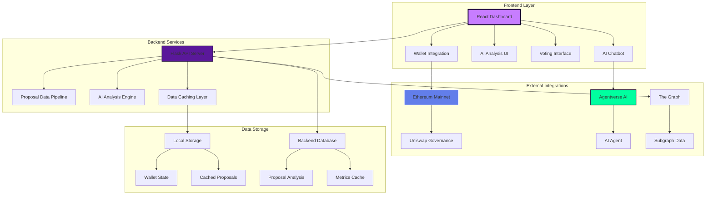

## Key Features

### Real-Time Proposal Tracking
- **Live Data Sync**: Direct integration with Ethereum mainnet and Uniswap governance
- **Automatic Updates**: Real-time proposal status monitoring with background refresh
- **Historical Analysis**: Complete proposal history with voting patterns and outcomes

### AI-Powered Analysis
- **Intelligent Recommendations**: ML-driven proposal analysis with confidence scores
- **Risk Assessment**: Automated risk evaluation and impact analysis
- **Context-Aware Insights**: Deep learning models trained on governance patterns

### On-Chain Voting
- **Direct Blockchain Integration**: Seamless voting through MetaMask
- **Gas Optimization**: Smart contract interaction with optimized transaction costs
- **Vote Verification**: Real-time vote confirmation and receipt generation

### Interactive AI Chatbot
- **Agentverse Integration**: Conversational AI for proposal discussions
- **Natural Language Queries**: Ask questions about proposals in plain English
- **Contextual Responses**: AI responses based on current proposal data

## Data Flow Architecture

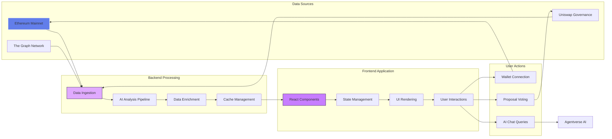

## Component Hierarchy

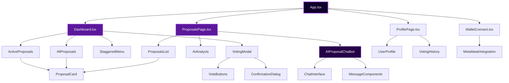

## API Integration Flow

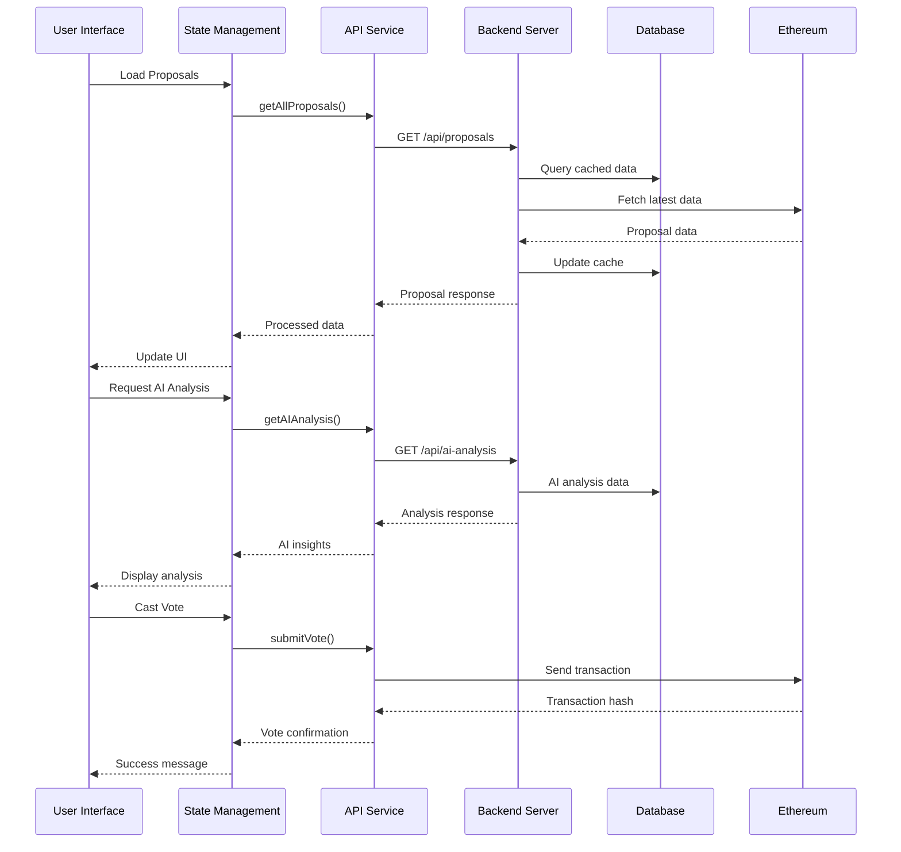

## Voting Process Flow

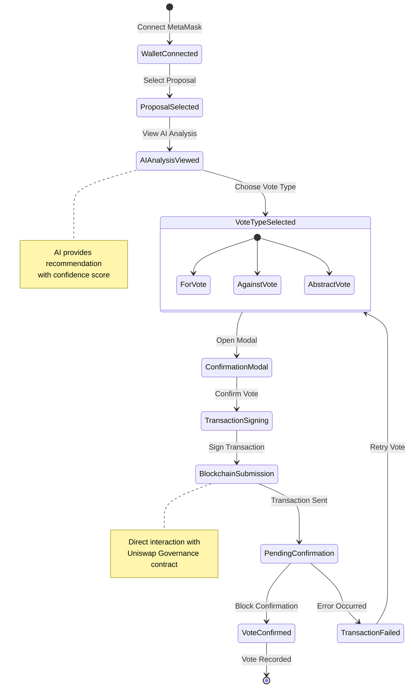

## AI Analysis Pipeline

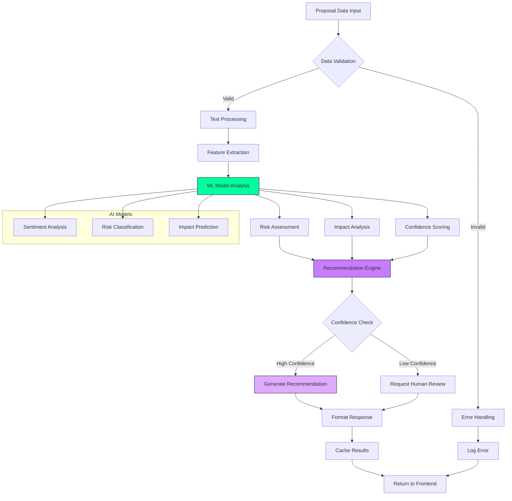

## Wallet Connection Flow

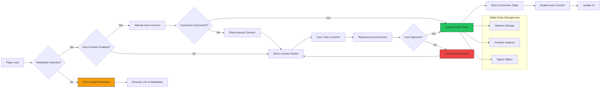

## Error Handling & Fallbacks

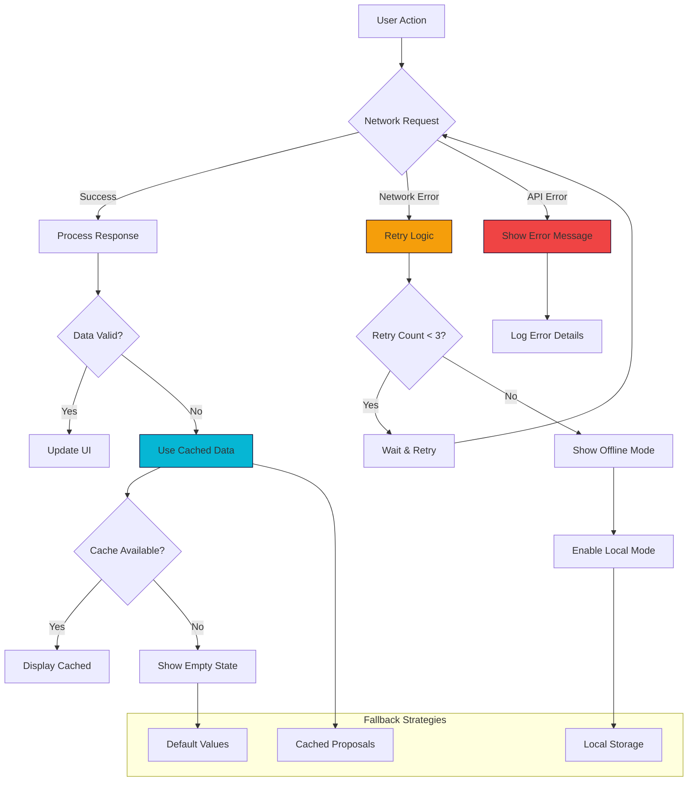

## Performance Metrics Dashboard

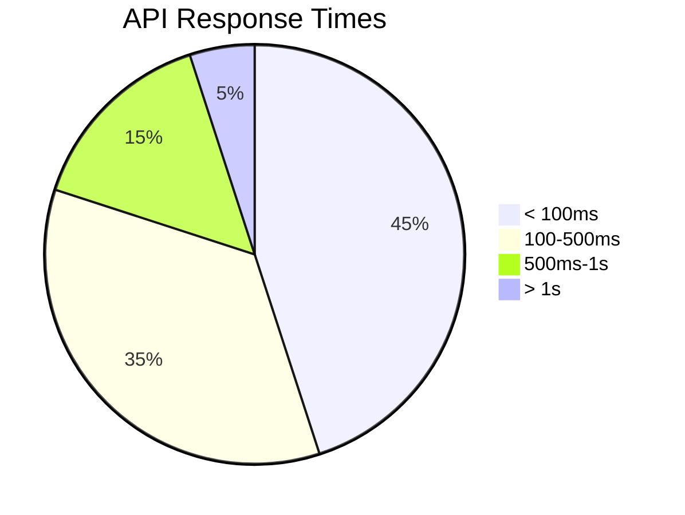

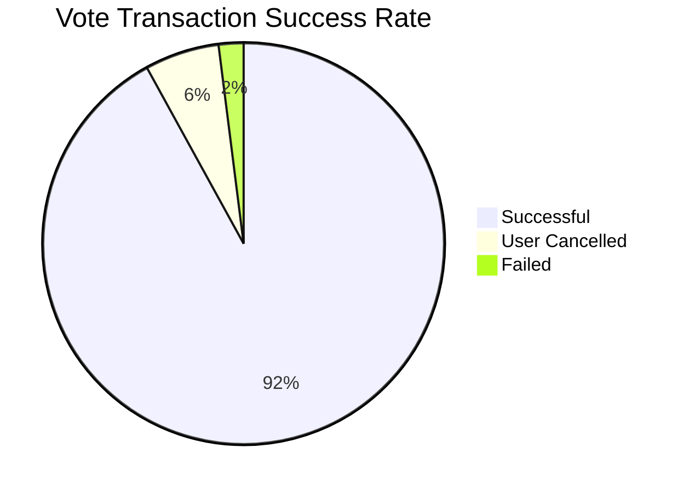

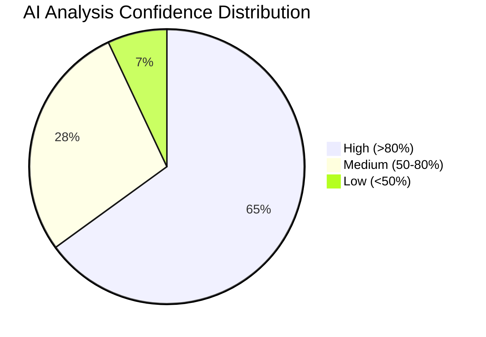

## Technical Stack

### Frontend Technologies
| Technology | Version | Purpose |
|------------|---------|---------|
| React | 19.1.1 | UI Framework |
| TypeScript | 5.8.3 | Type Safety |
| Vite | 7.1.7 | Build Tool |
| Tailwind CSS | 4.1.13 | Styling |
| GSAP | 3.13.0 | Animations |
| Ethers.js | 6.15.0 | Blockchain Integration |
| Three.js | 0.180.0 | 3D Graphics |

### Backend Technologies
| Technology | Purpose |
|------------|---------|
| Flask | API Server |
| Python | Backend Logic |
| SQLite/PostgreSQL | Data Storage |
| Pandas | Data Processing |
| Scikit-learn | ML Models |

## Installation & Setup

### Prerequisites
```bash
# Node.js (v18 or higher)
node --version

# npm or yarn
npm --version
```

### Environment Variables
Create a `.env` file in the root directory:

```env
# Blockchain Configuration
VITE_ETHEREUM_NETWORK=mainnet
VITE_INFURA_PROJECT_ID=your_infura_project_id

# Backend API
VITE_API_BASE_URL=http://localhost:5000
VITE_API_TIMEOUT=300000

# AI Integration
VITE_AGENT_ENDPOINT=https://agentverse.ai
VITE_AGENT_ADDRESS=your_agent_address

# Feature Flags
VITE_ENABLE_AI_CHAT=true
VITE_ENABLE_VOTING=true
VITE_ENABLE_ANALYTICS=true
```

### Frontend Setup

```bash
# Clone the repository
git clone https://github.com/officiallyutso/ethglobal-frontend.git
cd ethglobal-frontend

# Install dependencies
npm install

# Start development server
npm run dev

# Build for production
npm run build

# Preview production build
npm run preview
```

### Backend Setup

```bash
# Navigate to backend directory (if separate)
cd backend

# Install Python dependencies
pip install -r requirements.txt

# Set up environment variables
export FLASK_ENV=development
export DATABASE_URL=sqlite:///proposals.db

# Initialize database
python init_db.py

# Start Flask server
python app.py
```

## Usage Guide

### 1. Connecting Your Wallet

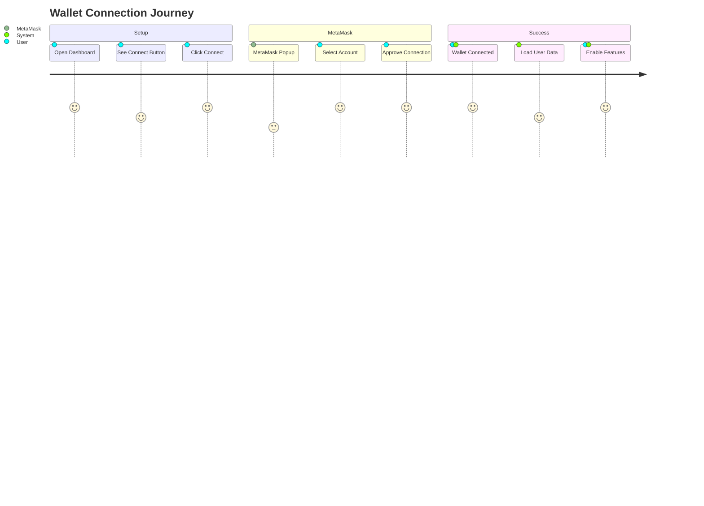

1. **Launch the Application**: Navigate to the dashboard URL
2. **Connect MetaMask**: Click "Connect Wallet" and approve the connection
3. **Automatic Reconnection**: The app remembers your choice for future visits
4. **Network Validation**: Ensures you're connected to Ethereum mainnet

### 2. Viewing Proposals

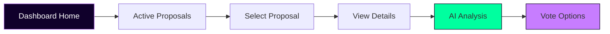

- **Active Proposals**: View currently active governance proposals
- **Historical Data**: Browse past proposals and their outcomes
- **Search & Filter**: Find specific proposals using the search functionality
- **Real-time Updates**: Data refreshes automatically every 30 seconds

### 3. AI Analysis Features

The AI analysis provides:

- **Recommendation**: FOR/AGAINST/ABSTAIN with reasoning
- **Confidence Score**: ML model confidence (0-100%)
- **Risk Assessment**: Potential risks and mitigation strategies
- **Impact Analysis**: Expected outcomes and implications
- **Historical Context**: Similar past proposals and their results

### 4. Casting Votes

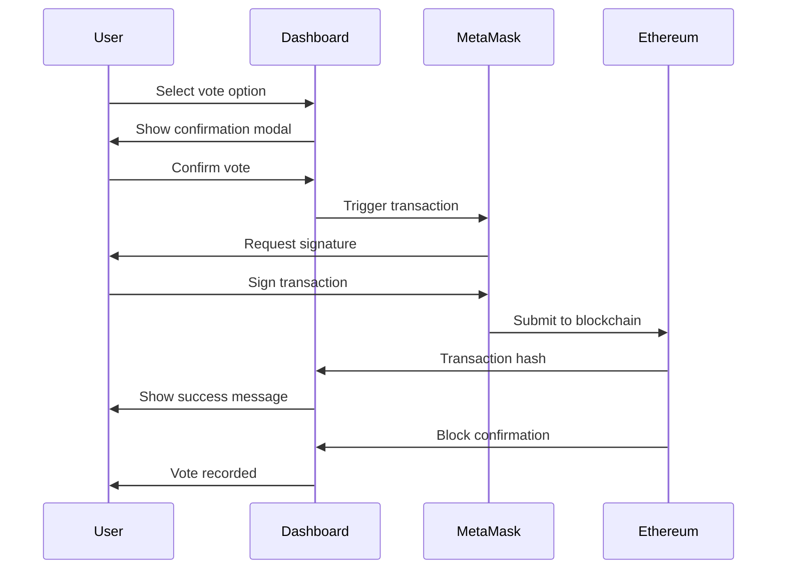

### 5. AI Chatbot Interaction

- **Contextual Questions**: Ask about specific proposals
- **Natural Language**: Use plain English to query proposal data
- **Suggested Questions**: Pre-built queries for common information
- **Real-time Responses**: Immediate AI-powered answers

## Development Guide

### Project Structure

```
ethglobal-dashboard/
├── src/
│   ├── components/           # Reusable UI components
│   │   ├── Dashboard.tsx
│   │   ├── VotingModal.tsx
│   │   ├── AIProposalChatbot.tsx
│   │   └── StaggeredMenu.tsx
│   ├── pages/               # Page components
│   │   ├── proposals/
│   │   └── profile/
│   ├── hooks/               # Custom React hooks
│   │   ├── useWallet.ts
│   │   └── useProposals.ts
│   ├── services/            # API and external services
│   │   ├── api.ts
│   │   ├── votingService.ts
│   │   └── agentApi.ts
│   ├── utils/               # Utility functions
│   │   └── proposalUtils.ts
│   └── types/               # TypeScript type definitions
├── public/                  # Static assets
├── backend/                 # Flask backend (if included)
└── docs/                   # Documentation
```

### Key Components

#### Dashboard.tsx
The main dashboard component featuring:
- Real-time proposal data
- Interactive voting interface
- AI analysis integration
- Responsive grid layout

#### AIProposalChatbot.tsx
Advanced chatbot component with:
- Agentverse AI integration
- Real-time messaging
- Contextual proposal discussions
- Animated UI interactions

#### VotingModal.tsx
Secure voting interface providing:
- Transaction confirmation
- Gas estimation
- Vote verification
- Error handling

### State Management Patterns

```typescript
// Custom hook example
export const useProposals = (limit?: number) => {
  const [allProposals, setAllProposals] = useState<Proposal[]>([])
  const [activeProposal, setActiveProposal] = useState<Proposal | null>(null)
  const [loading, setLoading] = useState(true)
  const [error, setError] = useState<string | null>(null)

  const refreshData = useCallback(async () => {
    // Refresh logic here
  }, [])

  return {
    allProposals,
    activeProposal,
    loading,
    error,
    refreshData
  }
}
```

### API Service Layer

The application uses a centralized API service for:
- Proposal data fetching
- AI analysis requests
- Backend communication
- Error handling and retries

```typescript
class ProposalAPI {
  private baseURL = API_BASE_URL

  async getAllProposals(): Promise<Proposal[]> {
    // Implementation
  }

  async getAIAnalysis(): Promise<APIResponse<AIAnalysisData[]>> {
    // Implementation
  }
}
```

## Testing

### Unit Tests
```bash
# Run unit tests
npm test

# Run with coverage
npm run test:coverage

# Run in watch mode
npm run test:watch
```

### Integration Tests
- API integration testing
- Wallet connection testing
- Voting flow validation
- AI analysis pipeline testing

### E2E Tests
- Complete user workflow testing
- Cross-browser compatibility
- Mobile responsiveness
- Performance benchmarks

## Deployment

### Production Build
```bash
# Create optimized production build
npm run build

# Analyze bundle size
npm run analyze

# Deploy to hosting platform
npm run deploy
```

### Environment Configuration

#### Development
- Hot module replacement
- Source maps enabled
- Debug logging active
- Mock data endpoints

#### Production
- Minified bundle
- Optimized assets
- Error tracking
- Performance monitoring

### Hosting Options

1. **Vercel** (Recommended)
   - Automatic deployments
   - Serverless functions
   - Global CDN

2. **Netlify**
   - Continuous deployment
   - Form handling
   - Split testing

3. **AWS S3 + CloudFront**
   - Maximum control
   - Custom domains
   - Advanced caching

## Monitoring & Analytics

### Performance Metrics
- Core Web Vitals tracking
- API response times
- Bundle size monitoring
- User interaction analytics

### Error Tracking
- Real-time error reporting
- Stack trace analysis
- User session replay
- Performance impact assessment

### Business Metrics
- Proposal engagement rates
- Voting participation
- AI analysis usage
- User retention

## Contributing


### Guidelines
1. **Fork the repository** and create a feature branch
2. **Write tests** for new functionality
3. **Update documentation** for any API changes
4. **Follow TypeScript** best practices
5. **Submit a pull request** with detailed description

### Code Standards
- ESLint configuration
- Prettier formatting
- TypeScript strict mode
- Component documentation
- Test coverage requirements

## API Reference

### Backend Endpoints

#### Proposals
```http
GET /api/proposals
GET /api/proposals/:id
POST /api/proposals/:id/vote
```

#### AI Analysis
```http
GET /api/ai-analysis
POST /api/ai-analysis/refresh
GET /api/ai-analysis/:proposal_id
```

#### System
```http
GET /health
GET /api/status
POST /api/refresh
```

## Security Considerations

### Wallet Security
- Private key never transmitted
- Secure MetaMask integration
- Transaction validation
- User consent for all operations

### API Security
- Rate limiting implementation
- Input validation
- CORS configuration
- Error message sanitization

### Data Privacy
- No personal data storage
- Wallet addresses only
- Public blockchain data only
- Optional analytics opt-out

## Troubleshooting

### Common Issues

#### Wallet Connection
```
Issue: MetaMask not connecting
Solution: Ensure MetaMask is unlocked and on Ethereum mainnet
```

#### Slow Loading
```
Issue: Proposals loading slowly
Solution: Check network connection and backend status
```

#### Vote Transactions
```
Issue: Vote transaction fails
Solution: Ensure sufficient ETH for gas fees
```

### Debug Mode
Enable debug logging by setting:
```env
VITE_DEBUG_MODE=true
```

## License

This project is licensed under the ISC License - see the [LICENSE](LICENSE) file for details.

## Acknowledgments

- **Uniswap Governance** for proposal data access
- **Agentverse** for AI analysis capabilities
- **MetaMask** for wallet integration
- **The Graph** for blockchain data indexing
- **ETHGlobal** for hackathon inspiration